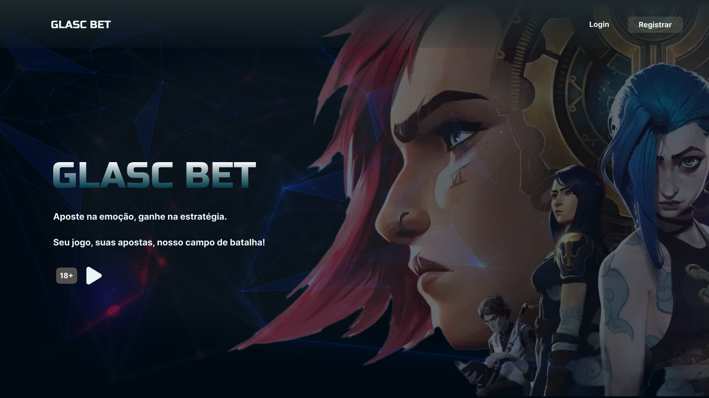

# GlascBet

Bem-vindo ao repositório do projeto **Glasc Bet**, desenvolvido pelo grupo Quimtec durante o hackathon 3 do Bootcamp da TripleTen. 
Glasc Bet é um site de apostas online focado em partidas de League of Legends (LoL). Oferece uma plataforma interativa e emocionante para os fãs do jogo colocarem suas apostas em eventos específicos.

### Ajustes e melhorias

O projeto ainda está em desenvolvimento e as próximas atualizações serão voltadas nas seguintes tarefas:

- [x] Melhoria no Layout responsivo
- [x] Implementar as funcionalidades dos modais
- [x] Colocar mais dados para a variedade de jogos 
- [ ] Arrumar arquivos de acordo com a metodologia BEM
- [ ] Interação da página inicial